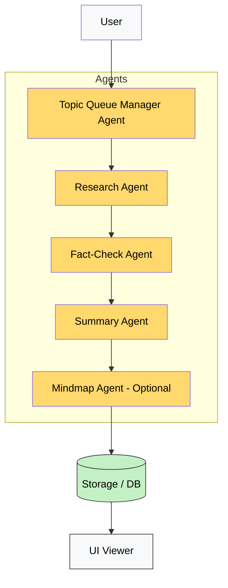

# learning-agents

## Create requirements.txt
`pipreqs . --encoding=latin-1 --ignore .venv`

## Project Goal Diagram

```mermaid
flowchart TD
    classDef agentStyling fill:#ffd86e,stroke:#33,stroke-width:1px,color:#000000

    A[User] --> B[Topic Queue Manager Agent]:::agentStyling
    B --> C[Research Agent]:::agentStyling
    C --> D[Fact-Check Agent]:::agentStyling
    D --> E[Summary Agent]:::agentStyling
    E --> F[Mindmap Agent - Optional]:::agentStyling
    F --> G[(Storage / DB)]
    G --> H[UI Viewer]

    subgraph Agents
        B
        C
        D
        E
        F
    end

    style A fill:#f8f9fa,stroke:#33,stroke-width:1px,color:#000000
    style G fill:#c4f0c5,stroke:#333,stroke-width:1px,color:#000000
    style H fill:#f8f9fa,stroke:#333,stroke-width:1px,color:#000000
```
